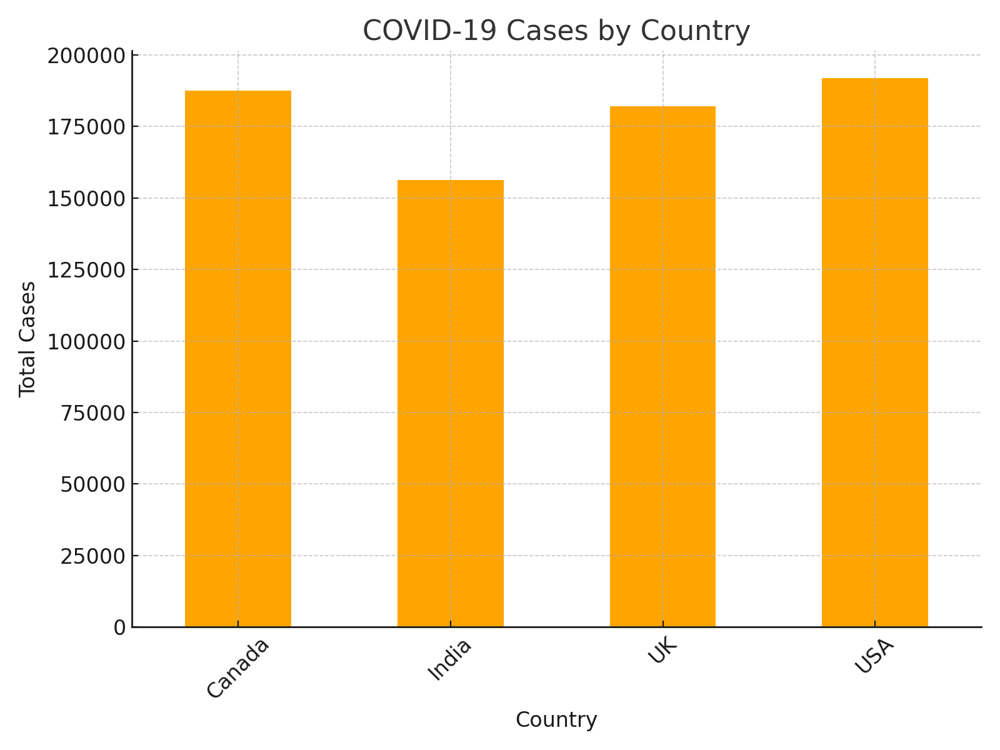

# 🦠 COVID-19 Analytics Platform

## 📌 Project Overview
This project analyzes **global COVID-19 case and vaccination data**.  
It demonstrates **automated ingestion, transformation, and dashboarding** using Azure services.

## ⚙️ Tech Stack
- **Azure Data Factory (ADF)** → Automated ingestion from public datasets  
- **Azure Data Lake Storage** → Raw/curated storage zones  
- **Azure Synapse Analytics** → Data warehouse with star schema  
- **SQL Server** → Fact/Dimension modeling  
- **Power BI** → Interactive dashboards & insights  

## 🚀 Workflow
1. **Data Ingestion**  
   - COVID datasets ingested daily via ADF.  
   - Data stored in staging tables.  

2. **Data Transformation**  
   - SQL scripts model data into **Fact & Dimension tables**.  
   - Schema supports OLAP queries.  

3. **Data Storage**  
   - Modeled in **star schema** with `fact_covid`, `dim_date`, and `dim_country`.  

4. **Visualization**  
   - Power BI dashboards track cases, deaths, and vaccination rates.  

## 📊 Dashboard Preview

## ✅ Skills Demonstrated
- **Automated ETL workflows** in Azure  
- **Fact/Dimension modeling** for analytics  
- **Daily data refresh** with ADF pipelines  
- **Interactive BI dashboards** with KPIs  

